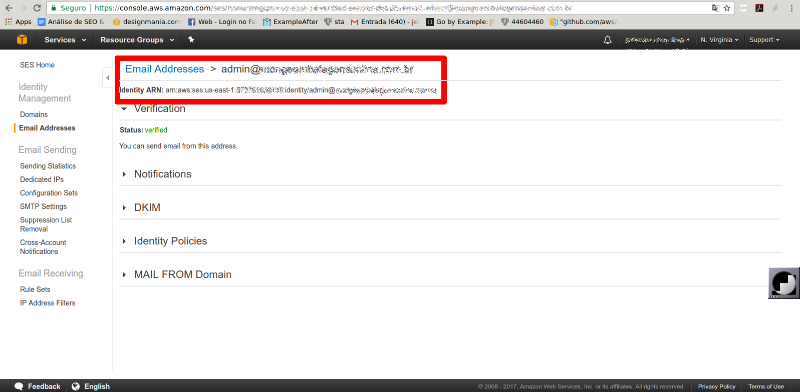

# GSES - AWS SES client from Go

> A package to send emails using AWS SES, facilitating its abstraction using the SES GO SDK.
> In order for your email to be sent successfully using the aws sdk you need to have an email validated by SES (Verify This Email Address), console access can be done by clicking here https://console.aws.amazon.com/ses, it will Also need your Identity ARN.

<!-- #### Verify This Email Address - SES Example



We only need to configure your keys beforehand so that AWS SES works correctly.

- export AWS_REGION="aws-region"
- export AWS_IDENTITY="aws-identity"
- export AWS_ACCESS_KEY_ID="aws-access-key-id"
- export AWS_SECRET_ACCESS_KEY="aws-secret-access-key"

The parameters you should use are:

 - MsgHTML := `<h1>Test send Email</h1>`
 - To :="your-email-here@email.com"
 - From :="noreply@yourserver.com"
 - FromMsg :="Message in email"
 - Title :="Your Title Here" -->

## Quickstart

```go

package main

import (
	"context"
	"log"
	"os"

	"github.com/jeffotoni/gses/v2/models"
	"github.com/jeffotoni/gses/v2/ses"
)

var (
	AWS_REGION            = os.Getenv("AWS_REGION")
	AWS_ACCESS_KEY_ID     = os.Getenv("AWS_ACCESS_KEY_ID")
	AWS_SECRET_ACCESS_KEY = os.Getenv("AWS_SECRET_ACCESS_KEY")

	AWS_FROM = os.Getenv("AWS_FROM")
	AWS_TO1  = os.Getenv("AWS_TO")
)

func main() {
	c := ses.NewClient(
		AWS_REGION,
		AWS_ACCESS_KEY_ID,
		AWS_SECRET_ACCESS_KEY,
	)

	req := models.DataEmail{
		ToAddresses:  []string{AWS_TO},
		From:         AWS_FROM,
		FromMsg:      "message",
		Title:        "title",
		MsgHTML:      "<h1>Hello World</h1>",
	}

	if err := c.Send(context.Background(), req); err != nil {
		log.Fatal(err)
	}
}

```

## Email sent

When you send an email, it can have the following data:

```go
type DataEmail struct {
	// Required at least 1
	ToAddresses  []string

	// Required
	From         string   
	
	// Required
	FromMsg      string   
	
	// Required
	Title        string   
	
	// Required
	MsgHTML      string   
	
	Charset      string
	BccAddresses []string
	CcAddresses  []string
	Attachments  []Attachment
}

type Attachment struct {
	Data []byte
	Name string
}
```

## Attachments and copies

```go

package main

import (
	"context"
	"log"
	"os"

	"github.com/jeffotoni/gses/v2/models"
	"github.com/jeffotoni/gses/v2/ses"
)

var (
	AWS_REGION            = os.Getenv("AWS_REGION")
	AWS_ACCESS_KEY_ID     = os.Getenv("AWS_ACCESS_KEY_ID")
	AWS_SECRET_ACCESS_KEY = os.Getenv("AWS_SECRET_ACCESS_KEY")

	AWS_FROM = os.Getenv("AWS_FROM")
	AWS_TO1  = os.Getenv("AWS_TO1")
	AWS_TO2  = os.Getenv("AWS_TO2")
	AWS_MSG  = ""
)

func main() {
	c := ses.NewClient(
		AWS_REGION,
		AWS_ACCESS_KEY_ID,
		AWS_SECRET_ACCESS_KEY,
	)

	fname1 := "file1.pdf"
	data1, err := os.ReadFile(fname1)
	if err != nil {
		log.Fatal(err)
	}

	fname2 := "file2.pdf"
	data2, err := os.ReadFile(fname2)
	if err != nil {
		log.Fatal(err)
	}

	req := models.DataEmail{
		ToAddresses:  []string{AWS_TO1},
		From:         AWS_FROM,
		FromMsg:      "message",
		Title:        "title",
		MsgHTML:      "<h1>Hello World</h1>",
		BccAddresses: []string{AWS_TO1, AWS_TO2},
		CcAddresses:  []string{AWS_TO1},
		Attachments: []models.Attachment{
			{Data: data1, Name: fname1},
			{Data: data2, Name: fname2},
		},
	}

	if err := c.Send(context.Background(), req); err != nil {
		log.Fatal(err)
	}
}

```

## [DEPRECATED] - v1 Quickstart

```go

package main

import (
	"fmt"

	ses "github.com/jeffotoni/gses"
)

func main() {
	MsgHTML := `<h1>Test send Email</h1>`
	To := "your-email-here@email.com"
	From := "noreply@yourserver.com"
	FromMsg := "Message in email"
	Titule := "Your Titule Here"

	ok, err := ses.SendEmail(To, From, FromMsg, Titule, MsgHTML)
	fmt.Println(ok)
	fmt.Println(err)

}

```